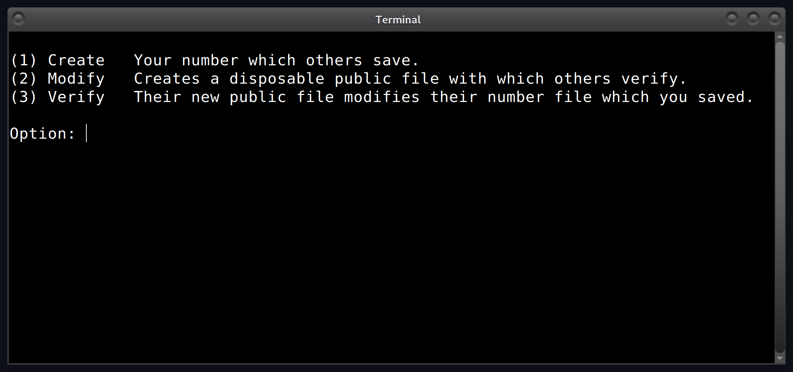
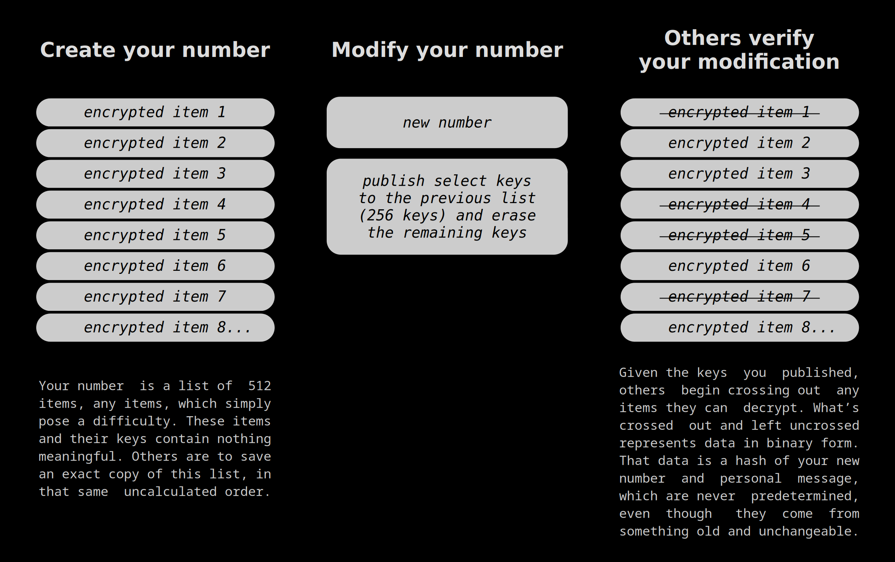
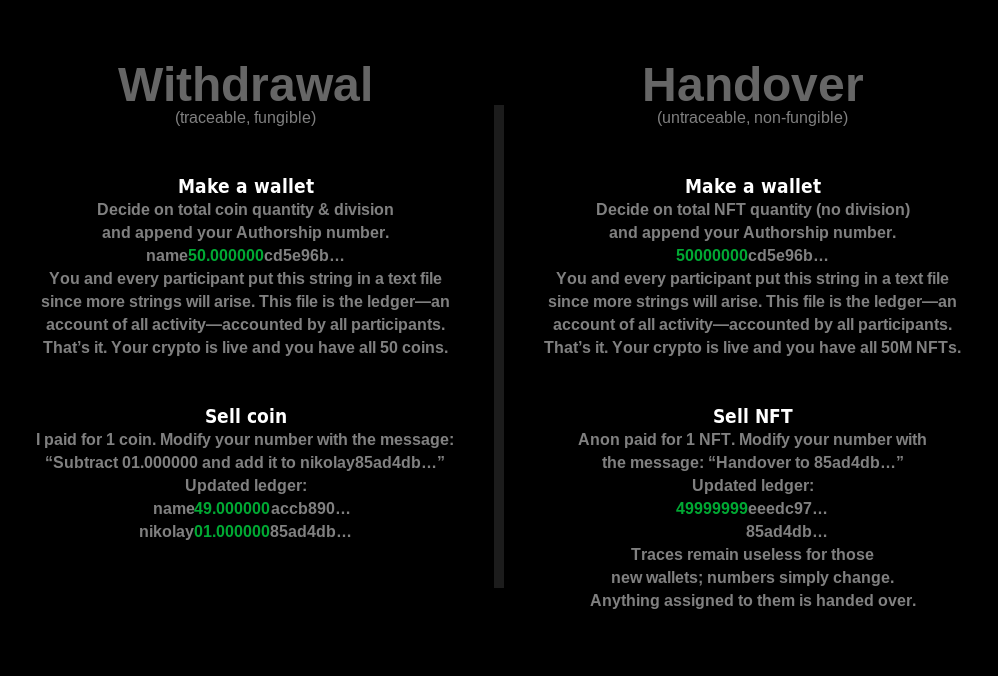

Run it: ```apt install g++ geany libgmp-dev```. Open the .cpp in Geany.<br>
Append ```-lgmp``` to Geany's compile & build commands. Hit F9 once. F5 to run.

<p align="center">
  
</p>

<br>
<br>

# How it works

<p align="center">
  
</p>

You can't prove that you created your content, or that
it's not fake or false. But you can prove it's coming
from you--not impersonation. And you're NEVER locked-in
to any type of encryption;
Data is authenticated using the binary
presence & absence of keys to lists of encrypted
items (hence publicly verifiable yet authorized-only.)
These encrypted items hide no substance of value,
their purpose is to pose difficulty
(hence independent of encryption type and symmetry.)

For comprehensibility, the diagram above didn't
mention the fact that actually, your number is a SHA-512
hash of 512 encrypted items, making it easy to
copy-paste numbers onto social media.
A hash is an intensely compressed version of a file,
where the original file must be provided in order to
reproduce that hash. And it is statistically difficult
to generate an impostor file, or any file,
responsible for that same hash.
That's because even a small change to the original file
yields a very different hash, thanks to the
avalanche effect of how a modern hash is generated.
Considering modern scams and how difficult it's
becoming to detect impersonation,
your Authorship number is a simple and accessible
door to authentication you can later jump from
to other such systems that have vital features.

### The wrong way

Let's say you published a list of encrypted items
then became a target for exposing war crimes.
Each time I ask for proof of life, you publish
one key, until you're out of keys.
You'll need to publish new lists.
But because you're a target,
I have to assume new encrypted
items under your name are impersonation.
How would you have forced that original list to symbolically point to
your NEW list that's not pregenerated to finiteness?
How would you have ensured that only you can make your lists point?
And how would you have ensured that this pointing is publicly verifiable?
Authorship does just that;

### The right way

Again, you published a list of encrypted items
then became a target for exposing war crimes.
Now, when I ask for proof of life, instead of releasing one key,
make a NEW list of encrypted items, then selectively release half the keys to that original list, all at once.
And now, as I look at your original list of encrypted items,
I cross out any that I can decrypt, using the keys you released.
When I take a step back,
a binary message appears;
what's crossed out and left uncrossed
represents ones and zeros not predetermined;
this one-time message can be anything you make it whenever you make it, even though it comes from something old and unchangeable.
And so you make this message represent personal thoughts for this event,
along with the hash of that new list
(so as to build an authorized-only relationship with that new list.)

<br>
<br>

# For

*   **Exposure is allowed**
    (typically authentication--rolling-code or not--relies
    on shared secrets; employers allow you to
    open doors only if that door accepts your
    private string of characters--matching what the
    door expects to see; The door is aware of a secret
    and must never expose it. But if instead the door
    contained your Authorship number, that ever-changing number
    can be displayed on the door and even made public.
    EVERYTHING you gave the door, and EVERYTHING the
    door contains, can be safely made public raw.)
*   **Compromise-evident device**
    (just as tamper-evident devices prove they've
    been tampered with, Authorship proves its user
    has been compromised; Your adversary's goal is
    to take your life and continue modifying
    your Authorship number--fooling us into thinking you're
    still there. But if your personal folder
    was protected, no one can modify on your behalf.
    This is how we'll know not to
    trust words under your name
    unless we can verify your
    number modification. In fact, compromise-evident is my tag because Authorship is my centerpiece and my masterpiece.)
*   **Canary update authentication**
*   **Group authorization**
    (Authorship numbers can be assembled using ciphertext from multiple users.)
*   **Animal theft management**
    (animal biometric data can be assigned to Authorship numbers in a ledger; If you can't modify the
    number associated with your animal, it's not your animal. Authority registrars should be able to
    easily identify animals such as by imaging a cow's wrinkly nose.)
*   **Voter fraud prevention**
    (you verify voters whom only registrars identify.)
*   **Ownership proof**
    (assign item to Authorship number, modify it with their message to prove ownership.)
*   **Cryptographer's acknowledgement**
    (you may need to verify that your new Authorship number
    is available to the public or verifying party--as you can be censored in some
    extreme circumstances. Here, the verifying party may arrange to modify their
    number in response and you can rest assured that your authentication
    event has been acknowledged.)
*   **Skipping through verification with outdated numbers**
    (here, the proving
    party had published multiple Authorship numbers beforehand. Their main number had changed
    so many times, public files older than a year for example, have been discarded.
    Now, those who have not verified since the number publishing, wish to know that
    each and every modification to this date is what the proving party intended.
    And so the proving party is asked to modify one of their slower numbers of
    higher viscosity. The message for that event instructs all verifying parties
    to overwrite the main number with a new one. Now those catching up have access
    to periodic verification as if they ran through the entire chain.)
*   **Disposable sessions without breaking trust**
    (let's say some service had
    published a single Authorship number beforehand, and serves one million users on their
    network years later. Each user requested in simultaneity and demanded
    authentication for each and every byte. Here, the service's number is not
    modified per user since that would require all users to catch up on verification
    as they wait their turn with the service. Instead, the service modifies its main
    number once with a message containing the SHA-256 hash of a text file of specified
    size uploaded separately. This text file contains one million new
    numbers--each disposable and dedicated to one user. Meanwhile, the service's
    new main number awaits future visitors who were forced to verify only once so far.
    Those without access to the public file for this main event may ask the service
    to modify a slower number--as done in the previous point.)
*   **And cryptocurrency:**

<p align="center">
  
</p>

<br>
<br>

# Security

* Uses a modified version of my https://github.com/compromise-evident/rolling-code , which means...
* Because ```digit_length = 200```... Just once, you must provide any file of
  200+ random first bytes. This creates a
  rolling-seeds file containing a 200-digit value, near which prime gaps are
  found, for generating randomness.
  Continued gaps are then used for the randomness in changing that value.
  You can alter this "private_seeds" file.
* A key is a 200-digit prime. Its randomness comes from
  a concatenation of prime gaps near a seed.
* A ciphertext (encrypted item) is 200 digits, and is
  a concatenation of prime gaps near a key.
* "Near which private prime, will I find these public gaps?"
  is at least as statistically strong as semiprime factorization.

<br>
<br>

# Why

Julian Assange and Edward Snowden used cryptographic evidence
systems generally too complex and inaccessible, which led many to uncertainty
in a time of great public distrust for government.
This inspired me to search for, discover (Dec 2019), and build Authorship--logical
authentication anyone can understand in 15 seconds.

<br>
<br>

# Try it now

Set ```digit_length``` to 30 so Authorship is faster.
For option 1, drop/enter the UNLICENSE file as the
"any file of 30+ random first bytes".
That should create a number file containing the following,
which is a SHA-512 hash of the file "512_ciphertext".

```text
a63023fd7a8e50b5337465f61d43f7bfaab6448b55ccf152d96777e85264eb77c44cdd7baf8a8e766e291deb06fcba0840d5a34f5adbb0d65be708d1bee297c0
```
